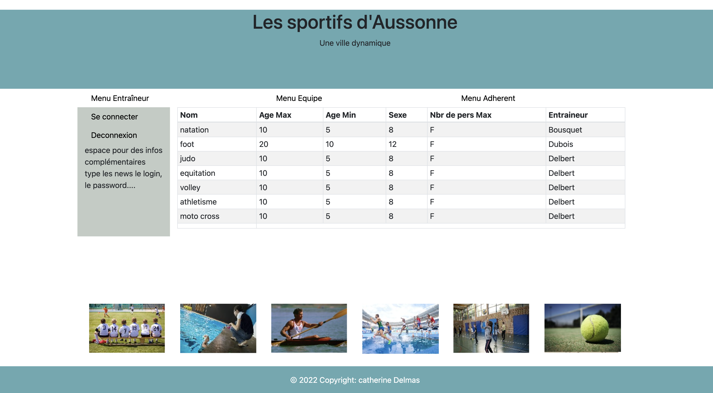

Application web destiné à une mairie dans un cadre sportif. Pour permettre de gérer l'enssemble des équipe. Les participants, les entraineurs. Ce projet à été réalisé durant mes deux années de BTS en cours pour nous permettre d'apprendre les bases du langage PHP et de la programmation orienté objet avec du javascript et des langage web.

- Architecture MVC
- `PHP` pour la partie back-end
- Langage web `HTML`, `CSS` et `Javascript` pour la partie front-end
- `Ajax` pour effectuer des requête au serveur tout en modifiant les pages web en conséquence

#### Récapitulatif :

1. Système d'autentification pour se connecter.
2. Gestion d'ajout, modification, suppression d'éauipes.
3. Gestion des joueurs, des entraineurs.
4. Gestion des types de sport.

## 1.5 : Mise à disposition d'un site internet

Ce site a été mis en place pour permettre de gérer les club sportif de la maire Aussonne en ligne.

## 1.4 : Méthode de travail pour ce projet

Pour la réalisation de ce projet nous avons étions plusieur dessus et nous avons donc utilisé le logiciel Trello pour pouvoir s'organiser dans notre développement avec une gestion des tâches.

## 1.2 : Incident et demandes d'assistance

Durant tout le développement de ce projet nous avions des demandes d'évolution et de modification de la part de notre professeur pour pouvoir faire évoluer le site web avec un système de sprint dans une méthode AGILE.

## 1.4 : Outils de versionning

Durant tout le développement de ce projet nous avons mis en place un système de versionning pour pouvoir conserver l'ensemble des fichiers du site chronologiquement avec différentes versions. De plus cela permete à tout le monde d'intervenir aussi sur le projet.

Pour ce projet nous avons donc utilisé le logiciel [GitHub](https://github.com/).
