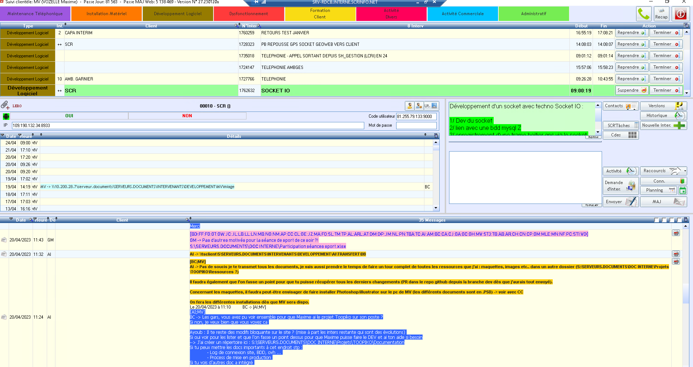
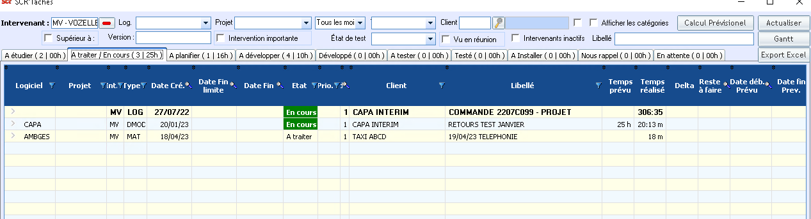

Application intranet web de gestion pour la société [CAPA Intérim](https://www.capainterim.com/) dans leur gestion des intérimaires, des véhicules, des logements et des entreprises. Ce projet a été réalisé durant ma deuxième année de BTS en Alternance pour l'entreprise SCR Informatique.

- Architecture MVC
- `PHP Symfony` pour la partie back-end
- Moteur de template `Twig` et `React` pour la partie front-end

Ce site a été mis en place pour remplacer des tableau Excel pour simplifier les liaisons entre lles différente tables.

#### Récapitulatif :

1. Chaque personnel (intérimaire) peut être attribué à un logement, à un véhicule et une entreprise.
2. Chaque logement et véhicule peuvent être rattachés à une agence et une assurance.
3. Ce site permet de gérer un système d'entretien pour les logements et les véhicules avec des alertes.
4. Une gestion d'équipements et d'utilisateur avec les rôles "utilisateur" et "admin"

## Méthode de travail pour ce projet

Dans mon entreprise actuelle nous utilisons notre propre système de gestion de projets avec notre propre logiciel interne qui s'appelle "suivi".

Pour ce projet j'ai donc reçu des inters équivalant à des "sprints" pour la création du site.

## Outils de versionning

Durant tout le développement de ce projet j'ai mis en place un système de version Ning pour pouvoir conserver l'ensemble des fichiers du site chronologiquement avec différentes versions. De plus cela permete aux autres personnes d'intervenir aussi sur le projet et donc de travailler en même dessus.

Pour ce projet j'ai donc utilisé le logiciel [GitHub](https://github.com/).

## Évolution du site web & exploitation des données de l'organisation

Durant toute la conception et le développement de ce site web j'ai été ammené à discuter plusieurs fois avec les clients sur différentes évolutions du site. J'ai été ammené à mettre plusieurs fois à mettre à jour le site directement sur le serveur hébergé par OVH. Je suis partie de plusieurs tableaux Excel comme donnée se départe pour pouvoir les insérer et les rendre compatibles avec le site.

## Resources

- <https://symfony.com//>
- <https://fr.legacy.reactjs.org//>
