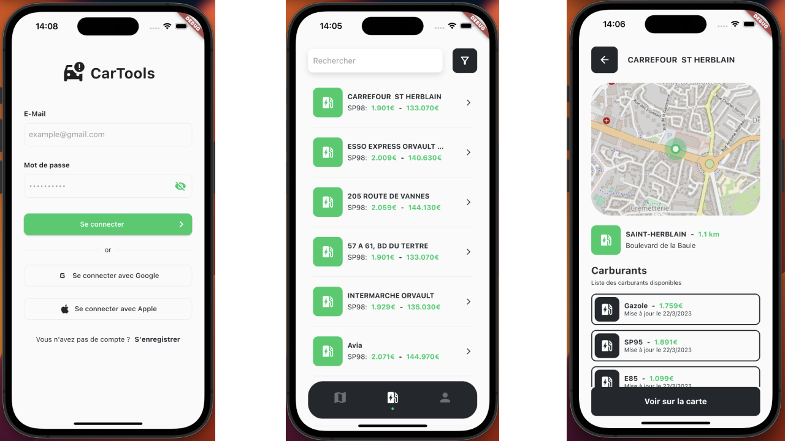

Application mobile multiplateforme fonctionnant sur Android et iOS pour la recherche de stations essence dans les alentours avec un système de filtres et de cartographie. Pour ce projet, nous étions deux, [Clément](https://clement-repel.fr/) et moi, et nous avons décidé de réaliser un hackathon avec pour objectif de développer une application mobile fonctionnelle en quelques jours.

- `Flutter` et `Dart` pour l'application mobile côté front-end
- `PHP Laravel` pour la partie back-end
- `MariaDB` pour la base de données
- `Docker` pour la conteneurisation
- Accessibilité multiplateforme sur `Android` et `iOS`

#### Récapitulatif :

1. Système d'authentification pour se connecter.
2. Système d'import pour récupérer tous les prix des stations du jour grâce à l'API du gouvernement qui nous retourne le nom et la marque de la station.
3. Filtre de recherche de stations d'essence sur la distance, le prix et le type de carburant.
4. Affichage des stations sur une carte via Mapbox et OpenStreetMap.

## 1.5 : Mise à disposition d'une application mobile

Cette application a été destinée à toutes les personnes possédant un véhicule pour leur permettre de trouver la meilleure station la plus proche. Chaque personne rentre les caractéristiques de son véhicule (consommation en litres, etc.)

## 1.2 : Incidents et demandes d'assistance

Durant tout le développement de ce projet, nous nous sommes chacun envoyé des demandes de modification pour faire évoluer l'application mobile et l'API.

## 1.4 : Méthode de travail pour ce projet

Pour la réalisation de ce projet, nous étions deux à travailler dessus et nous avons donc utilisé le logiciel GitHub pour pouvoir gérer l'avancement et le suivi du projet.

## 1.4 : Outils de versionning

Durant tout le développement de ce projet, nous avons mis en place un système de versionning pour pouvoir conserver l'ensemble des fichiers de l'application chronologiquement avec différentes versions. Ce qui nous a permis de travailler en même temps dessus.

Pour ce projet, nous avons donc utilisé le logiciel [GitHub](https://github.com/).
