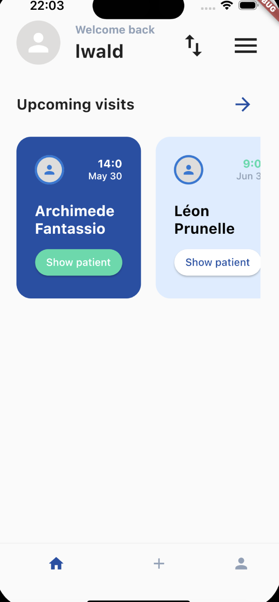

Application mobile multiplateforme fonctionnant sur Android et iOS pour la gestion des visites de chaque infirmière avec les soins de leurs patients. Système de login avec ajout et modification des visites et des soins. Visualisation de chaque patient sur une carte. Enregistrement des informations dans une base de données SQLite.

- `Flutter dart` pour l'application mobile
- Accessibilité multiplateforme `Android` et `iOS`

#### Récapitulatif :

1. Système d'authentification pour se connecter.
2. Système d'import pour récupérer toutes les visites et soins.
3. Gestion des visites (modification).
4. Gestion des soins (ajout, modification, suppression) et état des soins (réalisé ou non).

## 1.5 : Mise à disposition d'une application mobile

Cette application a été mise en place pour permettre de gérer les clubs sportifs de la mairie d'Aussonne en ligne.

## 1.2 : Incidents et demandes d'assistance

Durant tout le développement de ce projet, j'ai dû répondre aux demandes d'évolution et de modification de la part de mon professeur pour pouvoir faire évoluer l'application mobile.

## Outils de versionning

Durant tout le développement de ce projet, j'ai mis en place un système de versionning pour pouvoir conserver l'ensemble des fichiers de l'application chronologiquement avec différentes versions. De plus, cela permet à tout le monde d'intervenir aussi sur le projet.

Pour ce projet, j'ai donc utilisé le logiciel [GitHub](https://github.com/).
