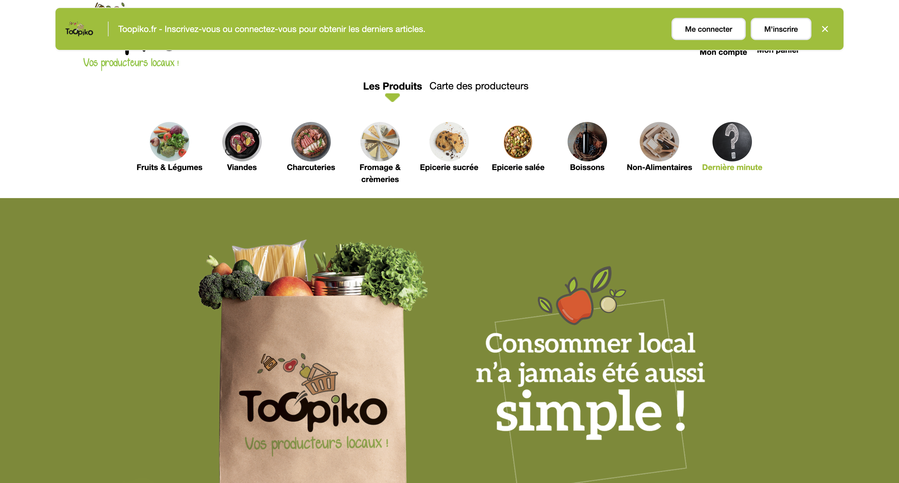
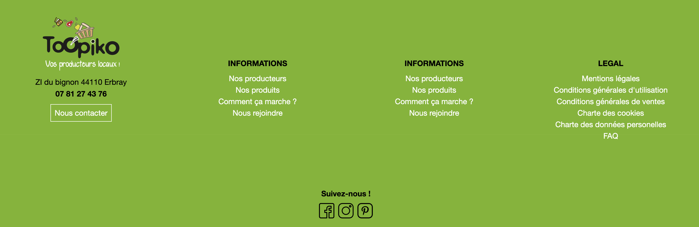

Site web e-commerce [Toopiko](https://toopiko.fr/) spécialisé dans la vente de produits locaux entre producteurs et consommateurs.

#### Récapitulatif :

1. Création des pages légales du site.

## 1.3 Développement de la présence en ligne aux niveau légal

J'ai commencé à travailler sur ce projet en entreprise, plus particulièrement sur la mise en place des pages légales du site web. Ce site est un site e-commerce destiné à tout le monde et doit obligatoirement comprendre ces pages. J'ai commencé à mettre en place ces pages.

1. Les mentions légales

- Le nom et l'adresse de l'entreprise qui gère le site.
- Le numéro d'identification de l'entreprise, le cas échéant.
- Les coordonnées de contact, telles que l'adresse e-mail et le numéro de téléphone.
- Les informations relatives au directeur de la publication du site, le cas échéant.
- Les informations relatives à l'hébergement du site.

2. Les conditions générales d'utilisation

- La description des produits alimentaires locaux proposés sur le site.
- Les modalités de commande et de paiement des produits avec les informations sur les frais d'expédition, les taxes, les remboursements et les échanges.
- Les modalités de retrait des produits en entrepôt, y compris les informations sur les rendez-vous et les horaires.
- Les obligations de l'utilisateur et les règles relatives à l'utilisation des informations et des contenus du site.
- Les droits et responsabilités de l'entreprise les informations sur la protection des données personnelles des utilisateurs.

3. Les conditions générales de vente (obligatoires pour un site ecommerce, en cas de retour 14 jours en france, sav, etc...)

- Les modalités de paiement des produits, y compris les options de paiement acceptées et les modalités de facturation.
- Les informations sur la livraison des produits les délais de livraison et les frais de livraison.
- Les modalités de retrait des produits en entrepôt avec les informations sur les rendez-vous et les horaires.
- Les obligations de l'utilisateur les règles relatives à l'utilisation des informations et des contenus du site.
- Les droits et responsabilités de l'entreprise les informations sur la protection des données personnelles des utilisateurs.
- Les modalités de remboursement et d'échange des produits avec les détails sur les conditions et les délais de retour.

## RGPD (Règlement général sur la protection des données)

Pour un site de e-commerce comme celui-ci, il est important de prendre en compte le RGPD pour la protection et la sécurité des utilisateurs.

- Sur leur consentement dans la collection de leur données personnelles ils doivent être informé
- Le droit de chaque utilisateur pour accéder à leurs données personnelles, pour l'ajout, la modification ou la suppressions de leurs informations
- La sécurtié des donnée des utilisateur en cas de pertes ou de voles d'informations
- Chaque site est responsable des données de leurs utilisateurs ils doivent mettre en place des politique en rapport avec lde RGPD
- En cas de violation des données personnelles les sites doivent informer leur utilisateurs dans les délais réglementaire
