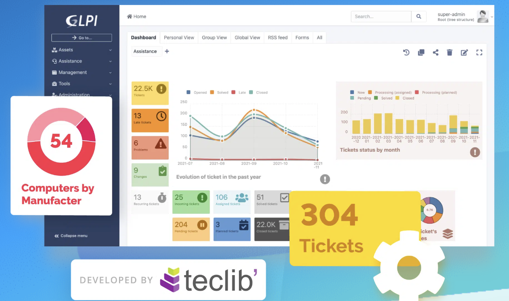

Mise en place d'un système de ticketing et de gestion de parc informatique avec l'outil [GLPI](https://glpi-project.org/fr/) qui permet de gérer et diagnostiquer les demandes des utilisateurs, de répondre rapidement et de trouver des solutions aux incidents. Il m'a permis de gérer l'infrastructure informatique complète avec un système d'inventaire.

- Système d'`inventaire`.
- Système de `ticketing`.

#### Récapitulatif :

1. Installation du logiciel GLPI sur une machine virtuelle.
2. Mise en place de la gestion d'inventaire.

## 1.2 : Incidents et demandes d'assistance

J'ai mis en place l'outil GLPI sur une machine virtuelle tournant sous Debian 11 pour pouvoir diagnostiquer et répondre aux incidents concernant les services réseaux et systèmes, avec une gestion de tickets pour traiter les demandes. Le but était de créer des tickets et d'y répondre entre deux utilisateurs que l'on avait créés.

## 1.1 : Gestion du patrimoine informatique

La mise en place de l'outil GLPI m'a permis de recenser et d'inventorier toutes les ressources numériques du réseau en les scannant. Ainsi, j'ai pu connaître les informations de chaque appareil et de leurs logiciels installés.
